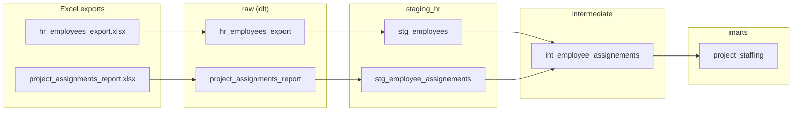

# PiwikPRO Analytics — Take-Home Solution

Two HR/PM Excel exports are loaded raw into DuckDB with `dlt`, then transformed
with `dbt` into `project_staffing`: one row per project with its lead, active
team size and active weekly hours.

## Prerequisites

Nothing else is needed: Python, dbt and DuckDB all live inside the image.

- **Docker**, with the daemon running ([install guide](https://docs.docker.com/engine/install/)).
  On Linux, add your user to the `docker` group (or prefix the commands with `sudo`).
- **git**, and the project cloned with `git clone` (not a zip download): the run
  block reads the current branch name from it.
- **A bash-like shell** (Linux, macOS, or WSL on Windows), since the run block
  uses `$(...)`, `tr` and `sed`.

Run every command from the repo root.

## How to run

```bash
mkdir -p output   # create it yourself, otherwise Docker creates it root-owned
export GIT_BRANCH=$(git rev-parse --abbrev-ref HEAD | tr '[:upper:]' '[:lower:]' | sed 's/[^a-z0-9]/_/g')
docker build -t piwikpro-analytics .
docker run --rm -e GIT_BRANCH -v "$(pwd)/output:/data" piwikpro-analytics
```

`GIT_BRANCH` must be set on every run: it puts each branch's dbt schemas side by
side (see Configuration). On `main` or `master` the schemas have no suffix.

This loads the Excel files, then runs `dbt build` (models and tests). The
database is written to `output/warehouse.duckdb`.

Any DuckDB client can open `output/warehouse.duckdb` directly to query the results.

### What you should see

`Done. PASS=39 WARN=1 ERROR=0`. The single warning is expected: `PROJ-2024-004`
has two active leads (see Data quality findings at the end). The result:

| project_code | project_name | project_lead | project_team_size | project_total_weekly_hours |
|---|---|---|---|---|
| PROJ-2024-001 | Platform Migration | Mark Tate | 3 | 68 |
| PROJ-2024-002 | Mobile App Redesign | Shane Ramirez | 4 | 84 |
| PROJ-2024-003 | Q1 Marketing Campaign | Robert Brown | 6 | 124 |
| PROJ-2024-004 | Data Pipeline Modernization | Taylor King | 3 | 88 |
| PROJ-2024-005 | Customer Portal | Jason Adams | 2 | 40 |
| PROJ-2024-006 | Internal Tools Refresh | *(null)* | 0 | 0 |
| PROJ-2024-007 | Security Audit Remediation | *(null)* | 6 | 104 |

The model also has `project_billable_team_size`, `project_total_billable_weekly_hours`
and `refreshed_date`.

### Configuration

- `DUCKDB_PATH`: database file, read by both the load and dbt so they always
  agree. It is `/data/warehouse.duckdb` in the image, which is why mounting
  `/data` keeps the database.
- `DBT_TARGET`: `dev` (default, 1 thread), `test` or `prod` (4 threads), e.g.
  `docker run -e DBT_TARGET=prod ...`.
- `GIT_BRANCH`: if set to anything other than `main` or `master`, the dbt schemas
  get a `_<branch>` suffix (schema-per-branch). The value is used as-is, so it
  must already be lowercase with only `[a-z0-9_]`. It is never detected
  automatically, which is why the run block exports a sanitized value and
  forwards it with `-e GIT_BRANCH`. `feature/Data-Pipeline` gives
  `marts_feature_data_pipeline`. If unset it behaves like `main`; the `raw`
  schema is created by dlt and is never suffixed.

## Layers

| Layer | Schema | Models | Purpose |
|---|---|---|---|
| Raw | `raw` | `hr_employees_export`, `project_assignments_report` | Untouched copy of the two Excel sheets, loaded by `load/load.py`. Only structural parsing, plus each file's own "generated" date. |
| Staging | `staging_hr` (views) | `stg_employees`, `stg_employee_assignements` | One model per source table: renaming, casting and simple derived flags (`employee_is_active`, `is_assignment_billable`, `employee_full_name`). No joins. |
| Intermediate | `intermediate` | `int_employee_assignements` | Joins each assignment to its employee. One shared input for the mart and the multi-lead test. |
| Marts | `marts` | `project_staffing` | The deliverable: one row per project. |



Every model and column is documented in `models/**/docs/<model>.yml`.

## What I'd add at scale

Deliberately not built here: each would be premature for one mart and one snapshot.

- **A point-in-time active check.** `employee_is_active` is a current-state flag.
  Here that is exact: every assignment starts on `2026-02-01`, after every hire and
  termination date. In an evolving system it would misreport people who were active
  during a past project and left later. The fix is a per-assignment condition
  (`assignment_start_date >= hire_date and (termination_date is null or
  assignment_start_date <= termination_date)`) in the `int_employee_assignements`
  join, with no snapshot tables needed.
- **A shared dimension/fact layer.** `int_employee_assignements` is the start of
  it. With more marts I'd add `dim_employees` (resolving the manager from
  `employee_reports_to` with a self-join), `dim_projects` and `fct_assignments`,
  so each new mart doesn't repeat the same joins.

## Data quality findings

| Finding | What I did |
|---|---|
| `Billable` is encoded four ways (`Y`, `Yes`, `N`, `No`) | Normalized to a boolean in staging, ignoring case and whitespace, `null` for anything else. A source-level `accepted_values` test fails if a new spelling appears, so it can't silently become `null`. |
| Title and date rows above the header, a `Billable?` header, possible trailing blank rows | Structural parsing in the load: the header and "Generated"/"Report Date" rows are found by content (it fails loudly if they aren't), blank rows are dropped, the trailing `?` is stripped so dlt doesn't mangle the column name. Values are untouched. |
| `PROJ-2024-004` has two active Leads (Taylor King 40 h, Courtney Mcclure 36 h) | One is picked deterministically; the warn-level test flags it. |
| `PROJ-2024-006` is staffed only by inactive employees, and both assignments start (2026-02-01) after the employee's termination | Left as-is. The project still appears with team size 0, hours 0, no lead. |
| `PROJ-2024-007` has no Lead role at all | `project_lead` is `null`. |
| 6 active employees are allocated over 40 h/week across projects (`EMP-1024` at 68 h) | Left as-is: the brief asks for hours allocated, so they're summed as reported. |
| 10 of 25 employees have no assignment | No impact: the mart is built from the assignments side. |
| Email formats vary; job titles look like generated filler | Left as-is, unused. |

Checked and clean: `status` and `termination_date` always agree, every assignment
resolves to a real employee, and there are no duplicate ids, duplicate
employee/project pairs or stray whitespace.
